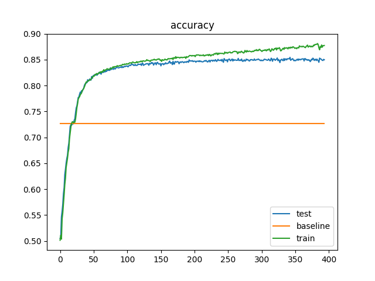

# VK data scientist test task
Таска на стажку в вк которую я не успел залить хотя доделал 😭

Задача классифицировать временные ряды на два класса.
### Описание решения
 - Модификация данных представляла из себя доведение их всех до одной длины, путем добавления слева и справа значений равных среднему значению ряда. Временная серия доводится до нужной длины по принципу добавления значений вместо не хватающих дат, т. е. если минимальная дата в датасете - 1-1-2016, а данный ряд начинается с 1-2-2017 слева добавлялось среднее ряда 13 раз. 
- В процессе экспериментов было опробованно 3 модели -- AdaBoostClassifier из sklearn на характеристиках временного ряда(mean, std, min, max...) достигшей точности предсказания в 0.78 на тестовой выборке, MLP из трех слоев с размером скрытого слоя в 1000 нейронов и функцией потери CrossEntropyLoss достигшей точности предсказания в 0.82 на тестовой выборке, и CNN, достигшей точности в 0.85. В финальном решении присутствует только последняя модель. Бейслайн решение(поставить всем 0 класс) выдает точость в 0.72.

")